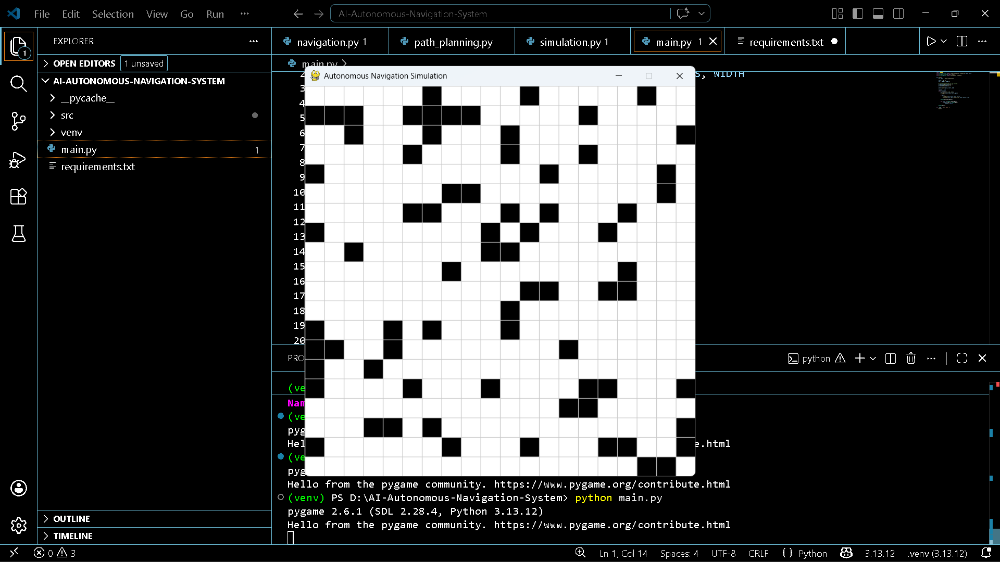
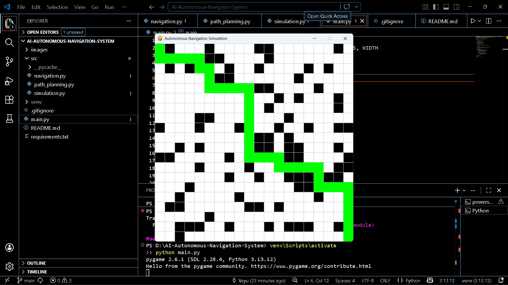
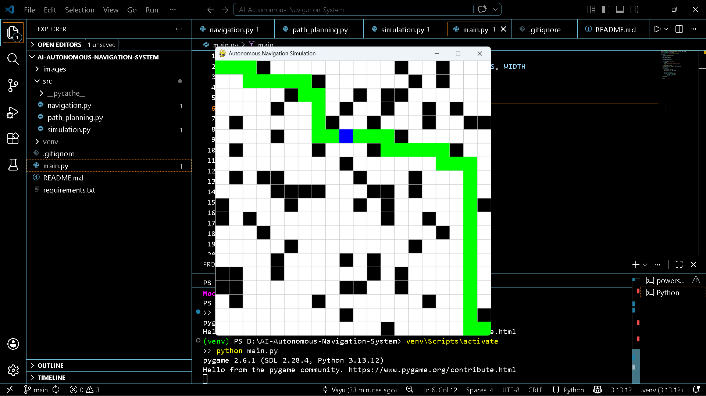

# 🚗 AI-Based Autonomous Navigation System

## 📌 Project Overview
This project demonstrates an AI-based autonomous navigation system built using Python.  
It simulates how a robot or self-driving vehicle navigates from a start point to a destination while avoiding obstacles.

The system uses the **A* (A-Star) path planning algorithm** to find the shortest and safest path in a grid-based environment.

---

## 🎯 Problem Statement
Autonomous systems need to navigate efficiently in environments with obstacles.  
This project solves the problem of **finding an optimal path while avoiding collisions** in a simulated environment.

---

## 🌍 Industry Relevance
This concept is widely used in:

- Self-driving cars 🚗
- Warehouse robots 📦
- Delivery robots 🤖
- Drone navigation 🚁
- Game AI 🎮
- Robotics automation 🏭

---

## 🛠️ Tech Stack

- Python
- Pygame (Simulation & Visualization)
- NumPy
- OpenCV (optional for future upgrades)

---

## ⚙️ System Architecture

```plaintext
Environment (Grid)
      ↓
Obstacle Generation
      ↓
Path Planning (A* Algorithm)
      ↓
Navigation (Agent Movement)
      ↓
Visualization (Pygame)
## 📸 Results

### Simulation


### Path Planning


### Navigation
